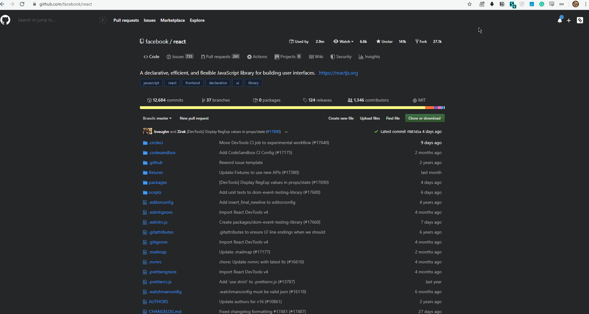

# Capture Page State

Get HAR logs, console logs, and screenshot to provide as much context as possible when reporting issues to developers. You can drop the HAR log file into the Network panel of any Chrome Dev Tools Window, and it will populate it.

## Demo

**You need to have Chrome Dev Tools open for HAR log only**.

## Usage Instructions
This Chrome Extension is not published to the Chrome Web Store, you need to install it in developer mode. You can find those instructions [here](#keyboard-shortcut)

1. Click on Extension Icon
2. Select what you want to capture
   1. Screenshot
   2. Console Logs
   3. HAR log
      1. **Chrome Dev Tools needs to be open to get HAR log**
3. Click on **Get Snapshot**
   1. The items selected will now be downloaded, 1 file per item

### Development
1. Clone this repository.
1. Open up Chrome and go to the `chrome://extensions/` page (Window → Extensions).
1. Enable developer mode (if it's not already).
1. Click on `Load unpacked extension`.
1. Select the folder for this extension.

### Specifications
* Getting Screenshot
  * Takes screenshot of active tab using **Chrome Tabs API**
* Getting Console Logs
  * `popup.js` ==>`background.js` then **Chrome Debugger API** is used to get console logs for the active tab and download them using **Chrome Downloads API**
* Getting HAR log
  * `popup.js` ==> `background.js` ==>`devtools.js` then **Chrome DevTools API** is used to get the HAR log `chrome.devtools.network.getHAR()` and downloaded using **Chrome Downloads API**

### What I Learned
* How to use [Chrome Downloads API](https://developer.chrome.com/extensions/downloads)
* Extending [Chrome Dev Tools](https://developer.chrome.com/extensions/devtools)
* How to use [Chrome Debugger API](https://developer.chrome.com/extensions/debugger)
    * [DevTools Protocol Docs](https://chromedevtools.github.io/devtools-protocol/)
* Messaging between `popup,js`, `background.js`, and `devtools.js`
  * https://developer.chrome.com/extensions/messaging
* What a [HTTP Archive Format (HAR)](http://www.softwareishard.com/blog/har-12-spec/) is made of

### Keyboard Shortcut
Go to the bottom of the `chrome://extensions/` page, click on `Keyboard shortcuts` and add the shortcut of your choice.

### Credits
* Icon made by Pixel perfect from www.flaticon.com
* [thingsinjars'](https://github.com/thingsinjars) [devtools-extension](https://github.com/thingsinjars/devtools-extension) helped me understand how to extend DevTools