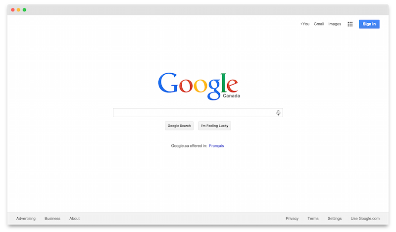

# Standardized Screenshot

A very opinionated screen capture extension for Google Chrome.

It will:

- Resize the browser window to be `1366px` wide.
- Capture the current tab.
- Add a OS X-ish title bar.
- Add drop shadow to it.
- Display the result in a new tab.
- Resize the browser window to the original size.

Note that the screenshot will be HiDPI-ish (pixel ratio of 2) for print purposes.

Forked and heavily mutated from [Full Page Screen Capture](https://github.com/mrcoles/full-page-screen-capture-chrome-extension).

### Install
You can get the extension on the [Chrome Store](http://goo.gl/TeyAJl).

### Development

1. Clone this repository.
1. Open up Chrome and go to the `chrome://extensions/` page (Window → Extensions).
1. Enable developer mode (if it's not already).
1. Click on `Load unpacked extension`.
1. Select the folder for this extension.

### Keyboard Shortcut

Go to the bottom of the `chrome://extensions/` page, click on `Keyboard shortcuts` and add the shortcut of your choice.
